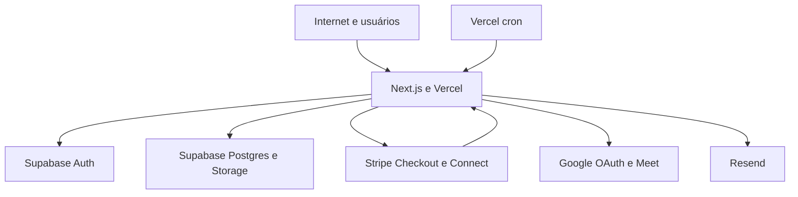

# Insidely — Threat Model e Varredura de Vulnerabilidades

## Executive summary

O projeto possui bons controles de autenticação, RLS, assinatura de webhook e validação de uploads. A falha crítica encontrada no baseline do Supabase — permissões de leitura e escrita de `PaymentAuditEvent` para `anon` e `authenticated` — foi corrigida remotamente pela migration `restrict_payment_audit_access`; a verificação posterior confirmou acesso apenas para `service_role`. Permanecem riscos altos condicionais em views `SECURITY DEFINER`, sincronização social por e-mail e isolamento entre usuários, que exigem revisão e testes negativos. A auditoria foi passiva; não foram realizados ataques contra produção.

## Scope and assumptions

- Em escopo: aplicação Next.js, rotas HTTP, Server Actions, Supabase Auth/Data API/Storage/RPCs, Stripe/Connect, Google OAuth/Meet, Resend e configuração Vercel.
- Fora de escopo: infraestrutura interna dos provedores, conta Google/Stripe/Supabase em si, dependências transitivas não auditadas pelo registry e testes ofensivos ativos.
- Assumido: aplicação pública em `insidely.vercel.app`, com usuários, consultores e administradores.
- Dados sensíveis: pagamentos, PII, mensagens, documentos de verificação, sessões e credenciais de integração.
- `.env` e `.env.local` existem localmente, mas não aparecem rastreados pelo Git; valores não foram exibidos.
- O `npm audit` não conseguiu consultar o endpoint do registry neste ambiente; portanto, a análise de dependências permanece aberta.

Open questions que alteram o risco: se o baseline/migrações foram aplicados integralmente em produção; se as permissões de `PaymentAuditEvent` foram corrigidas remotamente; e se o domínio de produção usa exatamente as mesmas variáveis e Redirect URLs verificadas no código.

## System model

### Primary components

- Next.js App Router e Server Actions: autenticação, perfis, agendamentos, mensagens, uploads e pagamentos (`src/app/actions.ts`).
- Supabase Auth, Postgres/RLS, Storage e RPCs: identidade, autorização, dados de usuários, bookings, pagamentos e documentos (`supabase/migrations/`, `src/lib/supabase/`).
- Stripe Checkout/Connect/Webhooks: cobrança, boleto/cartão, retenção e repasse (`src/lib/stripe-payments.ts`, `src/app/api/webhooks/stripe/route.ts`).
- Google OAuth/Meet e Resend: salas de reunião e notificações (`src/lib/google-meet.ts`, `src/lib/email.ts`).
- Vercel Functions e cron diário: execução pública e liberação de repasses (`vercel.json`, `src/app/api/cron/`).

### Data flows and trust boundaries

- Internet → Next.js: credenciais, formulários, mensagens, uploads e IDs; HTTPS, validação Zod/limites e `requireUser` em Server Actions.
- Next.js → Supabase Auth: cookies de sessão, OAuth codes e recuperação de senha; `getUser()`/troca de código e chaves públicas no cliente.
- Next.js → Supabase Data API/RPC: PII, bookings, mensagens, pagamentos e documentos; RLS e RPCs com `auth.uid()`, mas permissões do schema precisam ser conferidas no projeto remoto.
- Next.js → Stripe: valores, metadata e Connect IDs; segredo no servidor, Checkout e assinatura obrigatória no webhook.
- Stripe → webhook Next.js: eventos financeiros; validação de `stripe-signature` e claim idempotente em `StripeWebhookEvent`.
- Next.js → Google/Resend: refresh token, access token, e-mails e links Meet; chamadas HTTPS e segredos apenas no servidor.
- Cliente autenticado → Storage: imagens e documentos; assinatura curta para documentos e validação de tipo, tamanho e assinatura binária.

#### Diagram

## Assets and security objectives

| Asset | Why it matters | Security objective (C/I/A) |
|---|---|---|
| Pagamentos, Payment e TransferAttempt | Fraude, repasse indevido e disputa financeira | C/I/A |
| PaymentAuditEvent e StripeWebhookEvent | Evidência de integridade e idempotência financeira | I/A |
| PII, mensagens e perfis | Privacidade, reputação e segurança dos usuários | C/I |
| VerificationDocument | Documentos profissionais potencialmente confidenciais | C/I |
| Sessões, refresh tokens e chaves | Tomada de conta e acesso a provedores | C/I |
| Roles e políticas RLS | Separação entre usuário, consultor e admin | I |
| Links de Google Meet | Acesso a consultas privadas | C/I |
| Código e build da Vercel | Integridade da aplicação e segredos de produção | I/A |

## Attacker model

### Capabilities

- Usuário remoto pode criar conta, enviar formulários, mensagens, imagens/documentos e IDs manipulados.
- Usuário autenticado pode chamar rotas públicas, Server Actions, Data API e RPCs concedidas ao papel autenticado.
- Atacante pode tentar enumerar IDs, replay de webhooks, abuso de endpoints e exploração de configurações incorretas.
- Atacante pode obter dados públicos e observar respostas HTTP, mas não deve conhecer segredos do servidor.

### Non-capabilities

- Não se presume acesso ao painel dos provedores, ao filesystem de produção ou às chaves secretas.
- Não se presume controle do domínio, do projeto Supabase ou da conta Stripe.
- Não foi presumida execução de JavaScript arbitrário no servidor; não há evidência de `eval` ou subprocesso no runtime revisado.

## Entry points and attack surfaces

| Surface | How reached | Trust boundary | Notes | Evidence |
|---|---|---|---|---|
| Login/cadastro/OAuth | `/entrar`, `/cadastro`, `/auth/*` | Internet → Auth | Password, Google, LinkedIn, callbacks | `src/app/auth/`, `src/app/actions.ts` |
| Recuperação/troca de senha | `/recuperar-senha`, `/redefinir-senha` | Internet → Auth | Tokens de recuperação e sessão | `src/app/actions.ts:79-81` |
| MFA | `/mfa`, configurações | Usuário → Supabase Auth | TOTP e AAL2 | `src/components/mfa-settings.tsx` |
| Server Actions | Formulários autenticados | Browser → Next.js → DB | IDOR depende de RPC/RLS | `src/app/actions.ts` |
| Webhook Stripe | `POST /api/webhooks/stripe` | Stripe → Next.js → DB | Assinatura e idempotência | `src/app/api/webhooks/stripe/route.ts` |
| Uploads | Perfil/verificação | Usuário → Storage | Tipo, tamanho e magic bytes | `src/app/actions.ts:179-211` |
| Documento privado | `/api/verificacao/documento/[id]` | Usuário → Storage | Signed URL de 5 minutos | `src/app/api/verificacao/documento/[id]/route.ts` |
| Cron | `/api/cron/*` | Vercel → Next.js → DB | Bearer `CRON_SECRET` | `src/app/api/cron/` |
| Calendário | `/api/calendar/[id]` | Usuário → dados de booking | Restringe ao dashboard do usuário | `src/app/api/calendar/[id]/route.ts` |
| Supabase Data API | Tabelas/RPCs | Cliente → Postgres | Grants e RLS determinam isolamento | `supabase/baseline/schema.sql` |

## Top abuse paths

1. **Adulterar auditoria financeira:** atacante anônimo → usa grants de `PaymentAuditEvent` → insere/altera/apaga eventos → reduz capacidade de investigação de fraude.
2. **Exfiltrar documentos:** usuário autenticado → enumera ID de documento → depende de policy permissiva → recebe signed URL de documento de outro consultor.
3. **Tomar conta social por associação indevida:** atacante controla/obtém e-mail de uma conta existente → callback social faz fallback por e-mail → vincula `auth_user_id` ao perfil errado.
4. **Duplicar efeitos de webhook:** atacante/replay de evento válido → falha parcial após claim ou concorrência → estado financeiro e notificações divergentes; idempotência reduz, mas requer teste remoto.
5. **Abusar criação de salas:** pagamento confirmado repetidamente/concorrência → chamadas Meet para bookings sem URL → consumo de quota e ruído operacional.
6. **Abusar uploads:** usuário envia arquivos grandes ou muitos arquivos → Storage/moderação/Resend consomem recursos → indisponibilidade ou custo.
7. **Forçar cron protegido:** atacante obtém `CRON_SECRET` por configuração/log → chama cron → cria salas ou libera repasses em lote.

## Threat model table

| Threat ID | Threat source | Prerequisites | Threat action | Impact | Impacted assets | Existing controls (evidence) | Gaps | Recommended mitigations | Detection ideas | Likelihood | Impact severity | Priority |
|---|---|---|---|---|---|---|---|---|---|---|---|---|
| TM-001 | Anônimo/usuário autenticado | Migração antiga ou regressão de grants | Escreve/apaga/consulta `PaymentAuditEvent` | Trilha financeira falsificada ou apagada | Auditoria, pagamentos | Migration `20260826120000_restrict_payment_audit_access.sql` revoga acesso cliente; verificação remota confirmou somente `service_role` | Baseline antigo ainda contém grants amplos; migrações futuras podem reintroduzi-los | Manter migration corretiva; bloquear alterações manuais; revisar `information_schema.role_table_grants` após deploy | Alertar qualquer DML cliente nessa tabela; comparar contagem com Stripe | Low | High | medium |
| TM-002 | Usuário autenticado | ID de documento e policy permissiva | Obtém signed URL de documento alheio | Exposição de documentos confidenciais | VerificationDocument, PII | Rota exige sessão e URL expira em 300s | Rota não faz checagem explícita de dono/admin; depende integralmente de RLS | Validar dono/admin no servidor antes de assinar; negar seleção direta de metadados | Logs de acesso por user/document; alertas de enumeração | Medium | High | high |
| TM-003 | Atacante de conta social | Fallback por e-mail encontra perfil pré-existente | Vincula identidade OAuth ao perfil errado | Account takeover e acesso a bookings | Sessões, roles, PII, pagamentos | `getUser()` e service role; callback usa auth ID primeiro | Fallback por e-mail e criação de perfil precisam exigir prova de posse/estado controlado | Não vincular automaticamente por e-mail sem confirmação; usar fluxo de account linking autenticado e logar mudança | Alertar mudança de `auth_user_id`, e-mail/provider e IP | Medium | High | high |
| TM-004 | Cliente malicioso/atacante com segredo | `PaymentAuditEvent`/RPC ou service secret exposto | Injeta estados/eventos financeiros | Repasse ou suporte baseado em dados falsos | Payment, Booking, AuditLog | Webhook valida assinatura; RPCs fazem checks de `auth.uid()` | Grants e funções `SECURITY DEFINER` precisam de revisão remota; segredo não pode aparecer em logs | Revogar grants; restringir funções; usar allowlist de campos e transações idempotentes | Alertas para mudanças de status fora de webhook/service role | Low/Medium | High | high |
| TM-005 | Usuário autenticado | Enumeração de IDs e policy incorreta | Lê booking, mensagem ou payment de outro usuário | Violação de multi-tenancy | PII, mensagens, pagamentos | `requireUser`, RPCs e policies de participante | Auditoria remota de RLS não executada | Rodar Supabase security advisors e testes negativos com dois usuários isolados | Testes E2E de cross-tenant e logs de 403/404 | Medium | High | high |
| TM-006 | Atacante remoto | Abuso de upload/ações sem limite global | Envia muitos arquivos, moderação ou requests | Custo e indisponibilidade | Storage, compute, OpenAI/Resend | Limites por arquivo e magic bytes | Não há evidência de rate limit global para uploads/auth/checkout | Rate limit por usuário/IP; quotas Storage e alertas de custo | Métricas por IP/user e tamanho/quantidade | Medium | Medium | medium |
| TM-007 | Atacante com acesso a configuração | Segredo em Vercel/log ou cron exposto | Executa cron ou chama integrações | Liberação indevida, salas e dados | CRON_SECRET, Stripe, Google | Bearer secret e secrets server-side | Rotação/escopo e auditoria de secrets não comprovados | Rotacionar secrets; não logar valores; preferir mecanismo de cron autenticado pelo provedor | Alertas de chamadas fora da janela/IP esperado | Low | High | medium |
| TM-008 | Atacante de webhook | Conhece endpoint, sem segredo | Envia evento falso | Rejeitado pela assinatura | Pagamentos | `constructEvent` com `stripe-signature` | Secret correto de produção não foi verificado neste ambiente | Confirmar `whsec` do endpoint live e testar eventos assinados | Monitorar 400/500, eventos FAILED e discrepâncias Stripe/DB | Low | High | medium |

## Criticality calibration

- **Critical:** comprometimento direto de pagamentos, auditoria, roles ou dados confidenciais em escala. Exemplos: cliente consegue apagar `PaymentAuditEvent`; usuário assume conta/role de outro; segredo Stripe live exposto.
- **High:** acesso indevido entre usuários, documento privado, booking, mensagem ou repasse; ou falha de integridade financeira com pré-condições realistas.
- **Medium:** abuso que gera custo/indisponibilidade limitada, exposição parcial ou risco dependente de configuração não confirmada.
- **Low:** informação pública excessiva ou falha com pré-condições improváveis e sem impacto material.

## Focus paths for security review

| Path | Why it matters | Related Threat IDs |
|---|---|---|
| `supabase/baseline/schema.sql` | Grants e policies, especialmente `PaymentAuditEvent` | TM-001, TM-005 |
| `supabase/migrations/` | Funções `SECURITY DEFINER`, RLS e evolução do schema | TM-001, TM-004, TM-005 |
| `src/app/auth/callback/route.ts` | Associação social por auth ID/e-mail e uso de service role | TM-003 |
| `src/app/api/verificacao/documento/[id]/route.ts` | Assinatura de URL e autorização de documentos | TM-002 |
| `src/app/api/webhooks/stripe/route.ts` | Estados financeiros, replay e idempotência | TM-004, TM-008 |
| `src/lib/stripe-payments.ts` | Checkout, Connect, fees e transfers | TM-004, TM-008 |
| `src/app/actions.ts` | Server Actions, uploads e autorização | TM-002, TM-005, TM-006 |
| `src/app/api/cron/` | Operações privilegiadas acionadas por segredo | TM-007 |
| `.env.example` e Vercel envs | Contrato de segredos e ambientes | TM-007, TM-008 |

## Notes on use

- O scan encontrou placeholders de teste em `.env.example` e fixtures, não uma chave live rastreada pelo Git. Os valores locais não foram expostos.
- O `npm audit --omit=dev` falhou por indisponibilidade do endpoint do registry; repetir em CI/rede confiável.
- A correção crítica de `PaymentAuditEvent` foi aplicada em produção e verificada. Ainda é necessário executar testes negativos cross-tenant e decidir se as views `SECURITY DEFINER` são aceitáveis como projeções públicas limitadas.
- O relatório separa runtime de testes, mas a presença de `.next-e2e` gerado causou ruído no lint geral.

## Quality check

- Entrypoints públicos, Auth/OAuth, Server Actions, uploads, calendário, cron e webhook foram cobertos.
- Cada trust boundary aparece em pelo menos uma ameaça.
- Runtime, Supabase e integrações foram separados de testes/build.
- Contexto de produção pública e confidencialidade dos dados foi incorporado como premissa.
- Incertezas remotas, especialmente grants aplicados e variáveis de produção, estão explicitadas.
